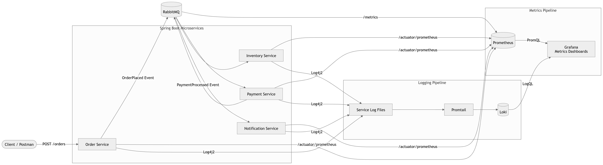
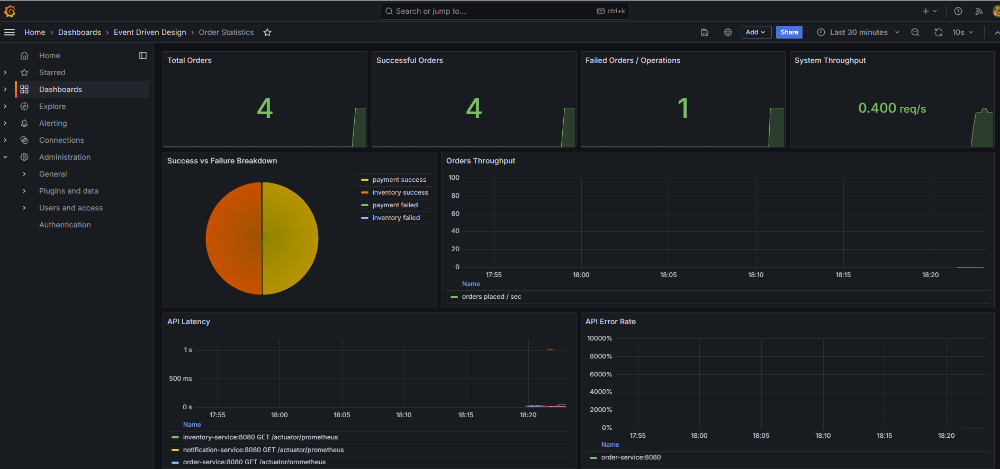

# Observability with Spring Boot, Prometheus, Grafana, Loki & Promtail

This project demonstrates a complete observability stack for a Spring Boot Event-Driven Architecture using **Prometheus**, **Grafana**, **Loki**, and **Promtail**.

It provides visibility into:

- Application health
- JVM and HTTP metrics
- Business metrics
- RabbitMQ metrics
- Centralized logging
- Service dashboards
- Log search and troubleshooting

---

# Architecture


---

# Technology Stack

| Tool | Purpose |
|-------|---------|
| Spring Boot Actuator | Health and runtime endpoints |
| Micrometer | Metrics collection |
| Prometheus | Metrics storage |
| Grafana | Metrics and log visualization |
| Loki | Log aggregation |
| Promtail | Log collector |
| Log4j2 | Application logging |
| RabbitMQ Prometheus Plugin | Broker metrics |
| Docker Compose | Local orchestration |

---

# Metrics Pipeline

Spring Boot applications expose metrics through the **Actuator Prometheus endpoint**.

```
Spring Boot
      │
      ▼
/actuator/prometheus
      │
      ▼
Prometheus
      │
      ▼
Grafana
```

Prometheus continuously scrapes metrics from:

- order-service
- payment-service
- inventory-service
- notification-service
- RabbitMQ

Example metrics:

- orders_placed_total
- orders_failed_total
- orders_payment_processed_total
- orders_inventory_reserved_total
- orders_notification_sent_total
- http_server_requests_seconds
- JVM metrics
- RabbitMQ queue metrics

---

# Logging Pipeline

Each service writes logs using **Log4j2**.

```
Spring Boot
      │
      ▼
Log Files
      │
      ▼
Promtail
      │
      ▼
Loki
      │
      ▼
Grafana
```

Promtail continuously watches log files and pushes them into Loki.

Grafana uses **LogQL** to search and visualize logs.

Example:

```logql
{job="service-logs", service="order-service"}
```

Search by Order ID:

```logql
{job="service-logs"} |= "ORDER_ID"
```

---

# Dashboards

## Spring Boot Services

Displays:

- Service Health
- HTTP Request Rate
- HTTP Latency
- JVM Memory Usage
- JVM Threads
- CPU Usage

---

## Order Statistics

Displays:

- Total Orders
- Successful Orders
- Failed Orders
- Orders Per Minute
- Payment Success
- Inventory Success
- Notification Success
- RabbitMQ Queue Depth

---

## Service Logs

Displays:

- Logs from all services
- Search by Order ID
- Filter by service
- Live log streaming

---

# Project Structure

```
observability/
│
├── grafana/
│   ├── dashboards/
│   └── provisioning/
│
├── prometheus/
│   └── prometheus.yml
│
├── loki/
│   └── loki.yml
│
├── promtail/
│   └── promtail.yml
│
└── docker-compose.yml
```

---

# Running the Stack

Start everything:

```bash
docker compose up --build
```

Stop:

```bash
docker compose down
```

Remove all persisted volumes:

```bash
docker compose down -v
```

---

# URLs

| Component | URL |
|-----------|-----|
| Grafana | http://localhost:3000 |
| Prometheus | http://localhost:9090 |
| RabbitMQ Management | http://localhost:15672 |
| RabbitMQ Metrics | http://localhost:15692/metrics |
| Loki | http://localhost:3100 |
| Order Service | http://localhost:8081 |
| Payment Service | http://localhost:8082 |
| Notification Service | http://localhost:8083 |
| Inventory Service | http://localhost:8084 |

---
# Dashboard Sample


---

# Key Features

- Centralized metrics collection
- Centralized log aggregation
- Spring Boot Actuator integration
- Micrometer instrumentation
- RabbitMQ monitoring
- Business metrics
- Live dashboards
- Log search using LogQL
- Docker-based deployment
- Production-style observability architecture

---

# Future Improvements

- OpenTelemetry Distributed Tracing
- Tempo Integration
- Jaeger Integration
- Alertmanager
- Slack Notifications
- Email Alerts
- Kubernetes Deployment
- Grafana Alert Rules
- Service Level Indicators (SLIs)
- Service Level Objectives (SLOs)

---

## License

This project is intended for educational purposes to demonstrate a complete observability setup for Spring Boot microservices using open-source tools.
