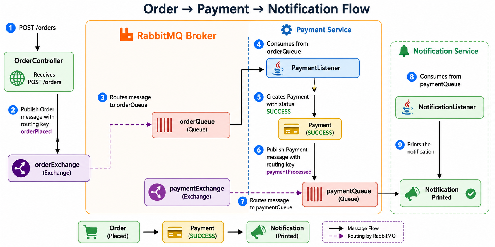

# Event-Driven Order Processing with RabbitMQ

This project demonstrates how to build an **Event-Driven Architecture (EDA)** using **Java, Spring Boot, and RabbitMQ**.

The application showcases how multiple microservices can communicate asynchronously through events while remaining loosely coupled.

The example implements an e-commerce workflow where:

- An order is placed.
- Payment processing and inventory reservation happen in parallel.
- A notification is sent once payment is completed.

---

## Architecture Overview

The system follows an event-driven approach where services communicate through RabbitMQ exchanges and queues instead of direct REST calls.

```text
                        OrderPlaced Event
                                 |
                                 v
                    +----------------------+
                    |    RabbitMQ Broker   |
                    +----------------------+
                             |
              ---------------------------------
              |                               |
              v                               v
      +---------------+              +----------------+
      | Payment Queue |              | Inventory Queue|
      +---------------+              +----------------+
              |                               |
              v                               v
      +----------------+            +------------------+
      | PaymentService |            | InventoryService |
      +----------------+            +------------------+
              |
              | PaymentProcessed Event
              v
      +-------------------+
      | paymentQueue      |
      +-------------------+
              |
              v
      +--------------------+
      | NotificationService|
      +--------------------+
```

---

## System Flow

1. Client sends a `POST /orders` request.
2. `OrderController` publishes an `OrderPlaced` event to RabbitMQ.
3. RabbitMQ routes the event to multiple queues.
4. `PaymentService` consumes the event and processes payment.
5. `InventoryService` consumes the same event and reserves stock.
6. Both services execute independently and in parallel.
7. `PaymentService` publishes a `PaymentProcessed` event.
8. `NotificationService` consumes the event.
9. Notification is sent to the customer.

---

## Architecture Diagram

---

---

## Tech Stack

- Java 25
- Spring Boot 3.x
- Spring AMQP
- RabbitMQ
- Maven
- Docker
- Docker Compose

---

## Features

✔ Event-Driven Architecture

✔ Asynchronous communication

✔ Loose coupling between services

✔ Parallel event processing

✔ RabbitMQ exchanges and queues

✔ Producer/Consumer model

✔ Publish-Subscribe pattern

---

## Project Structure

```text
src
├── controller
│   └── OrderController.java
│
├── config
│   └── RabbitMQConfig.java
│
├── producer
│   └── OrderProducer.java
│
├── listener
│   ├── PaymentListener.java
│   ├── InventoryListener.java
│   └── NotificationListener.java
│
├── model
│   ├── Order.java
│   ├── Payment.java
│   └── Inventory.java
│
└── Application.java
```

---

## RabbitMQ Components

### Exchanges

| Exchange | Purpose |
|-----------|---------|
| orderExchange | Receives OrderPlaced events |
| paymentExchange | Receives PaymentProcessed events |

### Queues

| Queue | Consumed By |
|--------|------------|
| orderQueue | Payment Service |
| inventoryQueue | Inventory Service |
| paymentQueue | Notification Service |

### Routing Keys

| Routing Key | Description |
|------------|-------------|
| orderPlaced | New order created |
| paymentProcessed | Payment successfully completed |

## Configuration

```yaml
spring:
  rabbitmq:
    host: rabbitmq
    port: 5672
    username: guest
    password: guest
```

---
---

## Running the Application

### Prerequisites

- Java 21
- Maven 3.9+
- Docker
- Docker Compose

### Clone the Repository

```bash
git clone https://github.com/tarunsharma8771/event-driven-design.git
cd event-driven-design
```

### Build the Application

```bash
mvn clean package
```

### Start Using Docker Compose

```bash
docker-compose up --build
```

### Access RabbitMQ Management UI

http://localhost:15672

Default credentials:

- Username: guest
- Password: guest

---

## Testing the Flow

Invoke:

```bash
postman request POST 'http://localhost:8081/orders' \
  --header 'Content-Type: application/json' \
  --body '{
  "product": "Laptop",
  "quantity": 2
}'
```

---

## Expected Console Output - Sample

```text
order-service-1         | Order received with ID: 4f43c277-901b-454b-8aae-ec292dbc6d69
payment-service-1       | Initiating payment for order ID: 4f43c277-901b-454b-8aae-ec292dbc6d69
inventory-service-1     | Reserving order with ID: 4f43c277-901b-454b-8aae-ec292dbc6d69
payment-service-1       | Payment completed for order ID: 4f43c277-901b-454b-8aae-ec292dbc6d69
notification-service-1  | Notification sent for order ID: 4f43c277-901b-454b-8aae-ec292dbc6d69 has status SUCCESS
```

---


RabbitMQ Management UI:

```text
http://localhost:15672
```

Default Credentials:

```text
Username: guest
Password: guest
```

## Key Concepts Demonstrated

- Event-Driven Architecture
- Producer/Consumer Pattern
- Publish-Subscribe Pattern
- Asynchronous Messaging
- Loose Coupling
- Parallel Processing
- Message Routing
- RabbitMQ Exchanges
- RabbitMQ Queues

---

## Future Enhancements

- Dead Letter Queue (DLQ)
- Retry Mechanism
- Idempotency Handling
- Shipping Service
- Distributed Tracing
- OpenTelemetry Integration
- Persistent Storage
- Saga Pattern Implementation

---

## Learning Objectives

After exploring this project, you will understand:

- How RabbitMQ works.
- How exchanges route messages.
- How multiple consumers process events in parallel.
- How Event-Driven Architecture improves scalability.
- How microservices communicate asynchronously.

---

## Contributing

Contributions are welcome.

Feel free to fork the repository and submit pull requests.

---

## License

This project is licensed under the MIT License.

